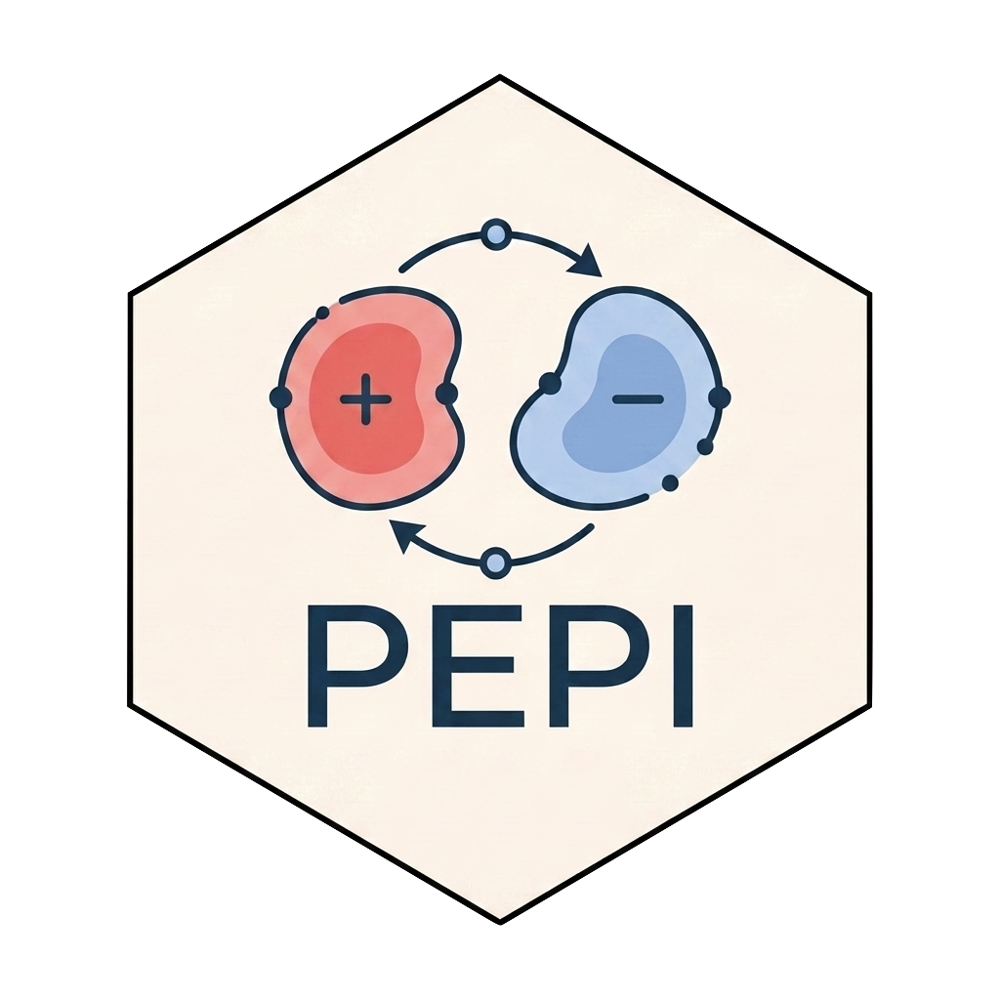

<!-- README.md is generated from README.Rmd. Please edit that file -->


# PEPI <a href="https://caravagnalab.github.io/PEPI/"></a>

<!-- badges: start -->
<!-- badges: end -->

PEPI is a software package implementing a statistical framework to study epigenetic dynamics from genomics data and cell count information. The model considers an experimental design in which cells are sorted according to their epimutation state (positive ⊕ vs. negative ⊖) prior to sequencing. Variant Allele Frequencies (VAFs) are then obtained from the two sorted populations at multiple time points. PEPI exploits the multivariate VAF spectrum and cell counts to quantify epigenetic dynamics.

#### Citation

If you use `PEPI`, please cite:  
* _Integrating clonal evolution and cell plasticity in chronic lymphocytic leukaemia with bimodal CD49d expression_ (in preparation)  
  Riccardo Bergamin, Giulio Caravagna, Clara Canavese  

#### Help and support

[](https://caravagnalab.github.io/PEPI)

## Installation

``` r
# Install devtools if not already installed
install.packages("devtools")

# Install PEPI from GitHub
devtools::install_github("caravagnalab/PEPI")
```

