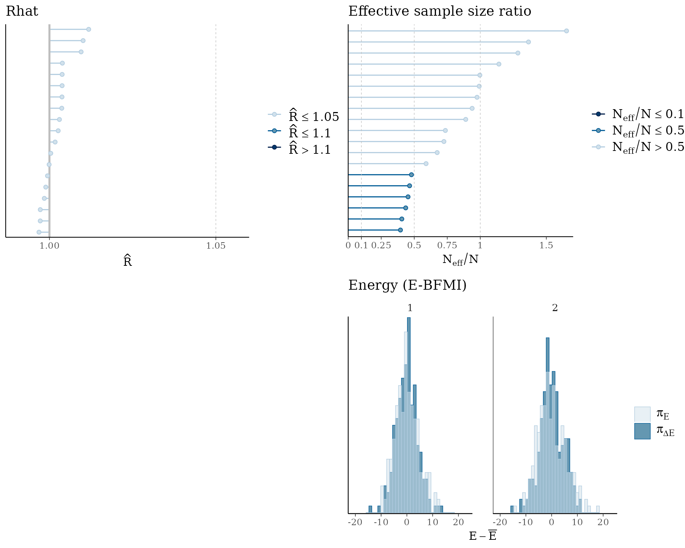
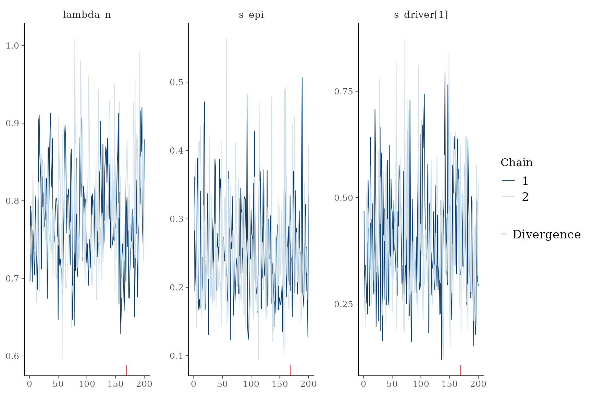
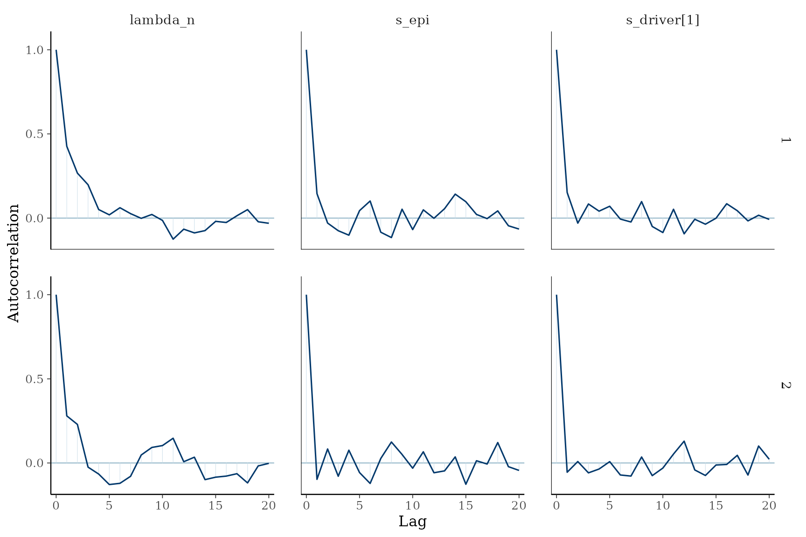
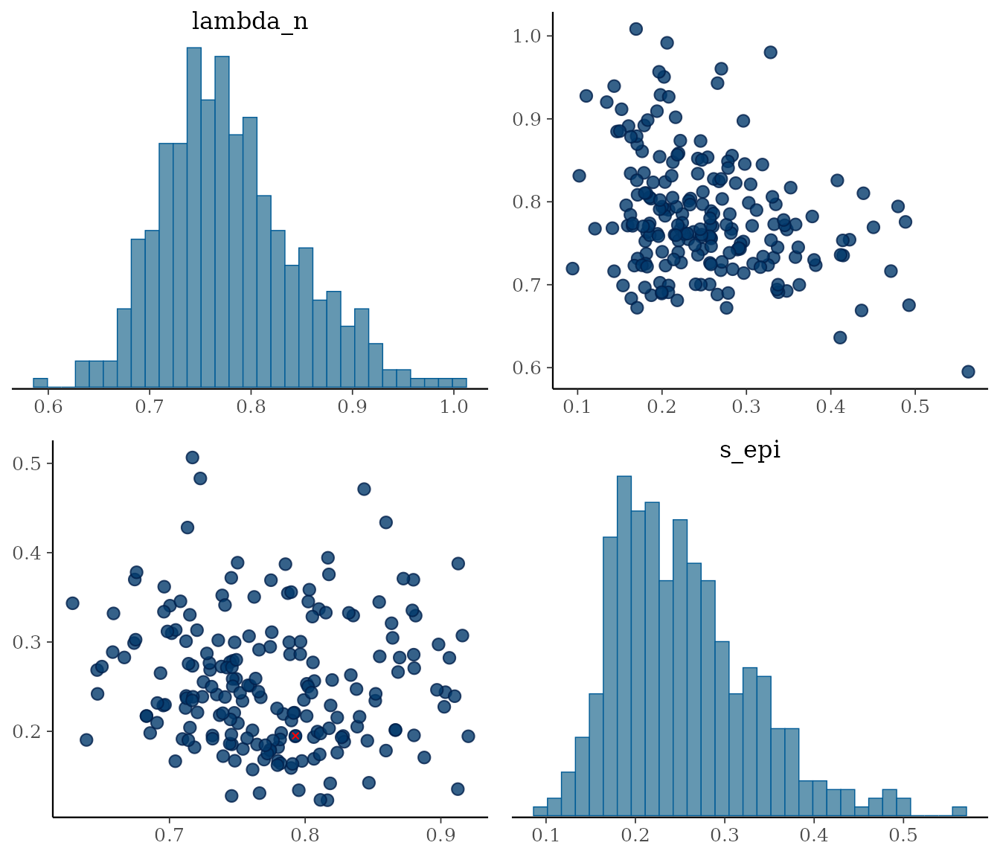
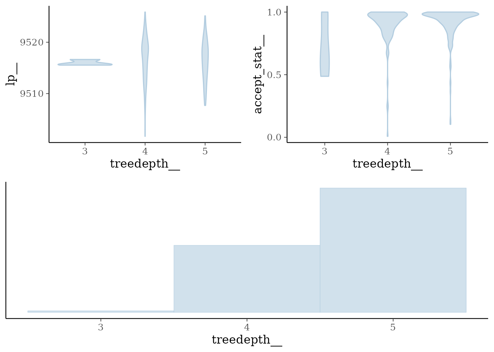

# Convergence diagnostics

``` r

library(PEPI)
library(cmdstanr)
#> This is cmdstanr version 0.8.0
#> - CmdStanR documentation and vignettes: mc-stan.org/cmdstanr
#> - CmdStan path: /home/runner/.cmdstan/cmdstan-2.39.0
#> - CmdStan version: 2.39.0
library(bayesplot)
#> This is bayesplot version 1.15.0
#> - Online documentation and vignettes at mc-stan.org/bayesplot
#> - bayesplot theme set to bayesplot::theme_default()
#>    * Does _not_ affect other ggplot2 plots
#>    * See ?bayesplot_theme_set for details on theme setting
```

[`fit_multirates()`](https://caravagnalab.github.io/PEPI/reference/fit_multirates.md)
defaults to `method = "variational"` (ADVI), a fast approximation with
no notion of chains, R-hat, divergences or treedepth. Whenever you need
to trust a result - not just eyeball it - fit with `method = "sample"`
(full Hamiltonian Monte Carlo / NUTS) instead, and use the diagnostics
below to check the chains actually converged. These are thin wrappers
around [bayesplot](https://mc-stan.org/bayesplot/), which already knows
how to read a `cmdstanr` fit directly, so there is no PEPI-specific
plotting logic to learn.

## Simulate data and fit with MCMC

``` r


set.seed(42)

sim = simulate_multirates_tree(
  sampling_times = c(3, 6, 9),
  tmrca = 1, t_min = 0,
  lambda_n = 1, s_epi = 0.15,
  omega_n_wt = 5e-3, omega_p_wt = 2e-3,
  drivers = list(
    list(id = "KRAS", t_driver = 2, s_driver = 0.3,
        omega_n_driver = 5e-3, omega_p_driver = 2e-3,
        ms_driver = -0.5, sigma_driver = 0.5,
        alpha_n_driver = 1, beta_n_driver = 10,
        alpha_p_driver = 1, beta_p_driver = 10)
  ),
  clades_wt = list(
    list(id = "c1", t_clade_wt = 1.5)
  ),
  mu = 1e-7, l = 2.7e9, kappa = 20, sigma_count = 0.1,
  seed = 42
)

x = init_multirates(sim$tables, m_trunk = sim$truth$m_trunk)

x = fit_multirates(x, cmdstan_path = cmdstanr::cmdstan_path(),
                   method = "sample", chains = 2, ndraws = 200, seed = 45,
                   mu = 1e-7, l = 2.7e9, t_min = 0, ms_epi = 0, sigma_epi = 0.5,
                   alpha_lambda = 1, beta_lambda = 1,
                   alpha_n_wt = 1, beta_n_wt = 10, alpha_p_wt = 1, beta_p_wt = 10,
                   min_kappa = 5, max_kappa = 200,
                   min_sigma_count = 0.01, max_sigma_count = 1)
#> CmdStan path set to: /home/runner/.cmdstan/cmdstan-2.39.0
#> Init values were only set for a subset of parameters. 
#> Missing init values for the following parameters:
#>  - chain 1: lambda_n, s_epi, omega_p_wt, omega_n_wt, bc_wt, U_wt, W_wt, bc_clade_wt, s_driver, bc_driver, U_driver, W_driver, s_driver_n, t_driver_n, bc_driver_n, s_driver_p, t_driver_p, bc_driver_p, s_dc, delta_t_dc, bc_driver_dc, bc_clade_dc, U_dc, W_dc, omega_p_dc, omega_n_dc, omega_p_driver, omega_n_driver, kappa, sigma_count
#>  - chain 2: lambda_n, s_epi, omega_p_wt, omega_n_wt, bc_wt, U_wt, W_wt, bc_clade_wt, s_driver, bc_driver, U_driver, W_driver, s_driver_n, t_driver_n, bc_driver_n, s_driver_p, t_driver_p, bc_driver_p, s_dc, delta_t_dc, bc_driver_dc, bc_clade_dc, U_dc, W_dc, omega_p_dc, omega_n_dc, omega_p_driver, omega_n_driver, kappa, sigma_count
#> 
#> To disable this message use options(cmdstanr_warn_inits = FALSE).
#> Running MCMC with 2 sequential chains...
#> Chain 1 Rejecting initial value:
#> Chain 1   Error evaluating the log probability at the initial value.
#> Chain 1 Exception: lub_constrain: lb is 4.87392, but must be less than 3.000000 (in '/tmp/RtmpXzPQde/model-1e9d4af68df0.stan', line 353, column 2 to column 81)
#> Chain 1 Exception: lub_constrain: lb is 4.87392, but must be less than 3.000000 (in '/tmp/RtmpXzPQde/model-1e9d4af68df0.stan', line 353, column 2 to column 81)
#> Chain 1 Rejecting initial value:
#> Chain 1   Error evaluating the log probability at the initial value.
#> Chain 1 Exception: lub_constrain: lb is 5.59741, but must be less than 3.000000 (in '/tmp/RtmpXzPQde/model-1e9d4af68df0.stan', line 353, column 2 to column 81)
#> Chain 1 Exception: lub_constrain: lb is 5.59741, but must be less than 3.000000 (in '/tmp/RtmpXzPQde/model-1e9d4af68df0.stan', line 353, column 2 to column 81)
#> Chain 1 Rejecting initial value:
#> Chain 1   Error evaluating the log probability at the initial value.
#> Chain 1 Exception: lub_constrain: lb is 6.88754, but must be less than 3.000000 (in '/tmp/RtmpXzPQde/model-1e9d4af68df0.stan', line 353, column 2 to column 81)
#> Chain 1 Exception: lub_constrain: lb is 6.88754, but must be less than 3.000000 (in '/tmp/RtmpXzPQde/model-1e9d4af68df0.stan', line 353, column 2 to column 81)
#> Chain 1 Iteration:    1 / 1200 [  0%]  (Warmup)
#> Chain 1 Informational Message: The current Metropolis proposal is about to be rejected because of the following issue:
#> Chain 1 Exception: lub_constrain: lb is 9, but must be less than 3.000000 (in '/tmp/RtmpXzPQde/model-1e9d4af68df0.stan', line 353, column 2 to column 81)
#> Chain 1 If this warning occurs sporadically, such as for highly constrained variable types like covariance matrices, then the sampler is fine,
#> Chain 1 but if this warning occurs often then your model may be either severely ill-conditioned or misspecified.
#> Chain 1
#> Chain 1 Informational Message: The current Metropolis proposal is about to be rejected because of the following issue:
#> Chain 1 Exception: lub_constrain: lb is 9, but must be less than 3.000000 (in '/tmp/RtmpXzPQde/model-1e9d4af68df0.stan', line 353, column 2 to column 81)
#> Chain 1 If this warning occurs sporadically, such as for highly constrained variable types like covariance matrices, then the sampler is fine,
#> Chain 1 but if this warning occurs often then your model may be either severely ill-conditioned or misspecified.
#> Chain 1
#> Chain 1 Informational Message: The current Metropolis proposal is about to be rejected because of the following issue:
#> Chain 1 Exception: lub_constrain: lb is 9, but must be less than 3.000000 (in '/tmp/RtmpXzPQde/model-1e9d4af68df0.stan', line 353, column 2 to column 81)
#> Chain 1 If this warning occurs sporadically, such as for highly constrained variable types like covariance matrices, then the sampler is fine,
#> Chain 1 but if this warning occurs often then your model may be either severely ill-conditioned or misspecified.
#> Chain 1
#> Chain 1 Informational Message: The current Metropolis proposal is about to be rejected because of the following issue:
#> Chain 1 Exception: lub_constrain: lb is 9, but must be less than 3.000000 (in '/tmp/RtmpXzPQde/model-1e9d4af68df0.stan', line 353, column 2 to column 81)
#> Chain 1 If this warning occurs sporadically, such as for highly constrained variable types like covariance matrices, then the sampler is fine,
#> Chain 1 but if this warning occurs often then your model may be either severely ill-conditioned or misspecified.
#> Chain 1
#> Chain 1 Informational Message: The current Metropolis proposal is about to be rejected because of the following issue:
#> Chain 1 Exception: lub_constrain: lb is 9, but must be less than 3.000000 (in '/tmp/RtmpXzPQde/model-1e9d4af68df0.stan', line 353, column 2 to column 81)
#> Chain 1 If this warning occurs sporadically, such as for highly constrained variable types like covariance matrices, then the sampler is fine,
#> Chain 1 but if this warning occurs often then your model may be either severely ill-conditioned or misspecified.
#> Chain 1
#> Chain 1 Informational Message: The current Metropolis proposal is about to be rejected because of the following issue:
#> Chain 1 Exception: lub_constrain: lb is 8.99695, but must be less than 3.000000 (in '/tmp/RtmpXzPQde/model-1e9d4af68df0.stan', line 353, column 2 to column 81)
#> Chain 1 If this warning occurs sporadically, such as for highly constrained variable types like covariance matrices, then the sampler is fine,
#> Chain 1 but if this warning occurs often then your model may be either severely ill-conditioned or misspecified.
#> Chain 1
#> Chain 1 Informational Message: The current Metropolis proposal is about to be rejected because of the following issue:
#> Chain 1 Exception: lub_constrain: lb is 5.17598, but must be less than 3.000000 (in '/tmp/RtmpXzPQde/model-1e9d4af68df0.stan', line 353, column 2 to column 81)
#> Chain 1 If this warning occurs sporadically, such as for highly constrained variable types like covariance matrices, then the sampler is fine,
#> Chain 1 but if this warning occurs often then your model may be either severely ill-conditioned or misspecified.
#> Chain 1
#> Chain 1 Informational Message: The current Metropolis proposal is about to be rejected because of the following issue:
#> Chain 1 Exception: lub_constrain: lb is 9, but must be less than 3.000000 (in '/tmp/RtmpXzPQde/model-1e9d4af68df0.stan', line 353, column 2 to column 81)
#> Chain 1 If this warning occurs sporadically, such as for highly constrained variable types like covariance matrices, then the sampler is fine,
#> Chain 1 but if this warning occurs often then your model may be either severely ill-conditioned or misspecified.
#> Chain 1
#> Chain 1 Informational Message: The current Metropolis proposal is about to be rejected because of the following issue:
#> Chain 1 Exception: lub_constrain: lb is 9, but must be less than 3.000000 (in '/tmp/RtmpXzPQde/model-1e9d4af68df0.stan', line 353, column 2 to column 81)
#> Chain 1 If this warning occurs sporadically, such as for highly constrained variable types like covariance matrices, then the sampler is fine,
#> Chain 1 but if this warning occurs often then your model may be either severely ill-conditioned or misspecified.
#> Chain 1
#> Chain 1 Informational Message: The current Metropolis proposal is about to be rejected because of the following issue:
#> Chain 1 Exception: lub_constrain: lb is 9, but must be less than 3.000000 (in '/tmp/RtmpXzPQde/model-1e9d4af68df0.stan', line 353, column 2 to column 81)
#> Chain 1 If this warning occurs sporadically, such as for highly constrained variable types like covariance matrices, then the sampler is fine,
#> Chain 1 but if this warning occurs often then your model may be either severely ill-conditioned or misspecified.
#> Chain 1
#> Chain 1 Informational Message: The current Metropolis proposal is about to be rejected because of the following issue:
#> Chain 1 Exception: lub_constrain: lb is 3.00815, but must be less than 3.000000 (in '/tmp/RtmpXzPQde/model-1e9d4af68df0.stan', line 353, column 2 to column 81)
#> Chain 1 If this warning occurs sporadically, such as for highly constrained variable types like covariance matrices, then the sampler is fine,
#> Chain 1 but if this warning occurs often then your model may be either severely ill-conditioned or misspecified.
#> Chain 1
#> Chain 1 Iteration:  100 / 1200 [  8%]  (Warmup)
#> Chain 1 Informational Message: The current Metropolis proposal is about to be rejected because of the following issue:
#> Chain 1 Exception: lub_constrain: lb is 3.29367, but must be less than 3.000000 (in '/tmp/RtmpXzPQde/model-1e9d4af68df0.stan', line 353, column 2 to column 81)
#> Chain 1 If this warning occurs sporadically, such as for highly constrained variable types like covariance matrices, then the sampler is fine,
#> Chain 1 but if this warning occurs often then your model may be either severely ill-conditioned or misspecified.
#> Chain 1
#> Chain 1 Iteration:  200 / 1200 [ 16%]  (Warmup) 
#> Chain 1 Iteration:  300 / 1200 [ 25%]  (Warmup) 
#> Chain 1 Iteration:  400 / 1200 [ 33%]  (Warmup) 
#> Chain 1 Iteration:  500 / 1200 [ 41%]  (Warmup) 
#> Chain 1 Iteration:  600 / 1200 [ 50%]  (Warmup) 
#> Chain 1 Iteration:  700 / 1200 [ 58%]  (Warmup) 
#> Chain 1 Iteration:  800 / 1200 [ 66%]  (Warmup) 
#> Chain 1 Iteration:  900 / 1200 [ 75%]  (Warmup) 
#> Chain 1 Iteration: 1000 / 1200 [ 83%]  (Warmup) 
#> Chain 1 Iteration: 1001 / 1200 [ 83%]  (Sampling) 
#> Chain 1 Iteration: 1100 / 1200 [ 91%]  (Sampling) 
#> Chain 1 Iteration: 1200 / 1200 [100%]  (Sampling) 
#> Chain 1 finished in 1.2 seconds.
#> Chain 2 Iteration:    1 / 1200 [  0%]  (Warmup)
#> Chain 2 Informational Message: The current Metropolis proposal is about to be rejected because of the following issue:
#> Chain 2 Exception: lub_constrain: lb is 9, but must be less than 3.000000 (in '/tmp/RtmpXzPQde/model-1e9d4af68df0.stan', line 353, column 2 to column 81)
#> Chain 2 If this warning occurs sporadically, such as for highly constrained variable types like covariance matrices, then the sampler is fine,
#> Chain 2 but if this warning occurs often then your model may be either severely ill-conditioned or misspecified.
#> Chain 2
#> Chain 2 Informational Message: The current Metropolis proposal is about to be rejected because of the following issue:
#> Chain 2 Exception: lub_constrain: lb is 9, but must be less than 3.000000 (in '/tmp/RtmpXzPQde/model-1e9d4af68df0.stan', line 353, column 2 to column 81)
#> Chain 2 If this warning occurs sporadically, such as for highly constrained variable types like covariance matrices, then the sampler is fine,
#> Chain 2 but if this warning occurs often then your model may be either severely ill-conditioned or misspecified.
#> Chain 2
#> Chain 2 Informational Message: The current Metropolis proposal is about to be rejected because of the following issue:
#> Chain 2 Exception: lub_constrain: lb is 9, but must be less than 3.000000 (in '/tmp/RtmpXzPQde/model-1e9d4af68df0.stan', line 353, column 2 to column 81)
#> Chain 2 If this warning occurs sporadically, such as for highly constrained variable types like covariance matrices, then the sampler is fine,
#> Chain 2 but if this warning occurs often then your model may be either severely ill-conditioned or misspecified.
#> Chain 2
#> Chain 2 Informational Message: The current Metropolis proposal is about to be rejected because of the following issue:
#> Chain 2 Exception: lub_constrain: lb is 9, but must be less than 3.000000 (in '/tmp/RtmpXzPQde/model-1e9d4af68df0.stan', line 353, column 2 to column 81)
#> Chain 2 If this warning occurs sporadically, such as for highly constrained variable types like covariance matrices, then the sampler is fine,
#> Chain 2 but if this warning occurs often then your model may be either severely ill-conditioned or misspecified.
#> Chain 2
#> Chain 2 Informational Message: The current Metropolis proposal is about to be rejected because of the following issue:
#> Chain 2 Exception: lub_constrain: lb is 8.99953, but must be less than 3.000000 (in '/tmp/RtmpXzPQde/model-1e9d4af68df0.stan', line 353, column 2 to column 81)
#> Chain 2 If this warning occurs sporadically, such as for highly constrained variable types like covariance matrices, then the sampler is fine,
#> Chain 2 but if this warning occurs often then your model may be either severely ill-conditioned or misspecified.
#> Chain 2
#> Chain 2 Informational Message: The current Metropolis proposal is about to be rejected because of the following issue:
#> Chain 2 Exception: lub_constrain: lb is 6.51592, but must be less than 3.000000 (in '/tmp/RtmpXzPQde/model-1e9d4af68df0.stan', line 353, column 2 to column 81)
#> Chain 2 If this warning occurs sporadically, such as for highly constrained variable types like covariance matrices, then the sampler is fine,
#> Chain 2 but if this warning occurs often then your model may be either severely ill-conditioned or misspecified.
#> Chain 2
#> Chain 2 Informational Message: The current Metropolis proposal is about to be rejected because of the following issue:
#> Chain 2 Exception: lub_constrain: lb is 9, but must be less than 3.000000 (in '/tmp/RtmpXzPQde/model-1e9d4af68df0.stan', line 353, column 2 to column 81)
#> Chain 2 If this warning occurs sporadically, such as for highly constrained variable types like covariance matrices, then the sampler is fine,
#> Chain 2 but if this warning occurs often then your model may be either severely ill-conditioned or misspecified.
#> Chain 2
#> Chain 2 Informational Message: The current Metropolis proposal is about to be rejected because of the following issue:
#> Chain 2 Exception: lub_constrain: lb is 9, but must be less than 3.000000 (in '/tmp/RtmpXzPQde/model-1e9d4af68df0.stan', line 353, column 2 to column 81)
#> Chain 2 If this warning occurs sporadically, such as for highly constrained variable types like covariance matrices, then the sampler is fine,
#> Chain 2 but if this warning occurs often then your model may be either severely ill-conditioned or misspecified.
#> Chain 2
#> Chain 2 Informational Message: The current Metropolis proposal is about to be rejected because of the following issue:
#> Chain 2 Exception: lub_constrain: lb is 5.75093, but must be less than 3.000000 (in '/tmp/RtmpXzPQde/model-1e9d4af68df0.stan', line 353, column 2 to column 81)
#> Chain 2 If this warning occurs sporadically, such as for highly constrained variable types like covariance matrices, then the sampler is fine,
#> Chain 2 but if this warning occurs often then your model may be either severely ill-conditioned or misspecified.
#> Chain 2
#> Chain 2 Iteration:  100 / 1200 [  8%]  (Warmup) 
#> Chain 2 Iteration:  200 / 1200 [ 16%]  (Warmup)
#> Chain 2 Informational Message: The current Metropolis proposal is about to be rejected because of the following issue:
#> Chain 2 Exception: lub_constrain: lb is 3.23029, but must be less than 3.000000 (in '/tmp/RtmpXzPQde/model-1e9d4af68df0.stan', line 353, column 2 to column 81)
#> Chain 2 If this warning occurs sporadically, such as for highly constrained variable types like covariance matrices, then the sampler is fine,
#> Chain 2 but if this warning occurs often then your model may be either severely ill-conditioned or misspecified.
#> Chain 2
#> Chain 2 Iteration:  300 / 1200 [ 25%]  (Warmup) 
#> Chain 2 Iteration:  400 / 1200 [ 33%]  (Warmup) 
#> Chain 2 Iteration:  500 / 1200 [ 41%]  (Warmup) 
#> Chain 2 Iteration:  600 / 1200 [ 50%]  (Warmup) 
#> Chain 2 Iteration:  700 / 1200 [ 58%]  (Warmup) 
#> Chain 2 Iteration:  800 / 1200 [ 66%]  (Warmup) 
#> Chain 2 Iteration:  900 / 1200 [ 75%]  (Warmup) 
#> Chain 2 Iteration: 1000 / 1200 [ 83%]  (Warmup) 
#> Chain 2 Iteration: 1001 / 1200 [ 83%]  (Sampling) 
#> Chain 2 Iteration: 1100 / 1200 [ 91%]  (Sampling) 
#> Chain 2 Iteration: 1200 / 1200 [100%]  (Sampling) 
#> Chain 2 finished in 1.3 seconds.
#> 
#> Both chains finished successfully.
#> Mean chain execution time: 1.2 seconds.
#> Total execution time: 2.6 seconds.
#> Warning: 1 of 400 (0.0%) transitions ended with a divergence.
#> See https://mc-stan.org/misc/warnings for details.
```

## One-call dashboard

[`plot_diagnostics()`](https://caravagnalab.github.io/PEPI/reference/plot_diagnostics.md)
arranges the four checks you should look at first - R-hat, effective
sample size, divergences and the HMC energy diagnostic - into a single
figure.

``` r

plot_diagnostics(x)
#> Warning: Groups with fewer than two datapoints have been dropped.
#> ℹ Set `drop = FALSE` to consider such groups for position adjustment purposes.
#> Groups with fewer than two datapoints have been dropped.
#> ℹ Set `drop = FALSE` to consider such groups for position adjustment purposes.
#> `stat_bin()` using `bins = 30`. Pick better value `binwidth`.
#> `stat_bin()` using `bins = 30`. Pick better value `binwidth`.
```



- **R-hat** (top left): the potential scale reduction factor, one point
  per parameter. Values close to 1 mean the chains agree with each
  other; anything above about 1.05 means they haven’t converged to the
  same distribution and you need more iterations (or the model is
  misspecified).
- **Effective sample size ratio** (top right): $`N_{eff}/N`$, one point
  per parameter. Low ratios mean the chain is highly autocorrelated -
  the raw draws contain less independent information than their count
  suggests.
- **Divergences** (bottom left): transitions the sampler had to abandon
  because the numerical integrator became unstable. Even a handful can
  bias posterior estimates in the region where they occur.
- **Energy / E-BFMI** (bottom right): the marginal energy distribution
  ($`\pi_E`$) should closely track the energy transition distribution
  ($`\pi_{\Delta E}`$); a systematic mismatch signals inefficient
  exploration.

## Digging deeper into individual diagnostics

Each panel above is also available on its own, and accepts a `params`
argument (Stan parameter base names, no brackets - indexed parameters
like `s_driver` are expanded to all of their elements automatically) to
zoom in on a specific subset.

``` r

plot_trace(x, params = c("lambda_n", "s_epi", "s_driver"))
```



Trace plots overlay each chain’s path through the parameter space over
iterations; well-mixed chains look like “fuzzy caterpillars” with no
trend and substantial overlap between chains.

``` r

plot_acf(x, params = c("lambda_n", "s_epi", "s_driver"))
```



Autocorrelation should decay quickly with lag; slow decay is the same
problem the effective-sample-size panel flags, just visualised directly.

``` r

plot_pairs(x, params = c("lambda_n", "s_epi"))
```



Pairs plots are the standard way to spot the funnel-shaped geometries
that cause divergences (marked in red, if any) - a divergence cluster
concentrated in a narrow region of this plot points at exactly which
parameters are hard to sample jointly.

``` r

plot_treedepth(x)
```



Chains that repeatedly hit the maximum treedepth are being cut off
before making a U-turn; this hurts sampling efficiency (though, unlike
divergences, it does not necessarily bias the posterior).

## What to do if something looks wrong

- **High R-hat / low ESS**: run more iterations (`ndraws`), or more
  chains (`chains`) so R-hat has more information to detect
  disagreement.
- **Divergences**: tighten the priors that are letting the sampler
  explore an implausible, poorly-conditioned region (e.g. narrow
  `min_kappa`/ `max_kappa`, `min_sigma_count`/`max_sigma_count` bounds,
  or gamma priors on the switch rates `omega_*` closer to the scale you
  actually expect).
- **Both persist**: fall back to `method = "variational"` for fast
  iteration while adjusting the model/data, and only switch to
  `method = "sample"` once instructed as a final check.
