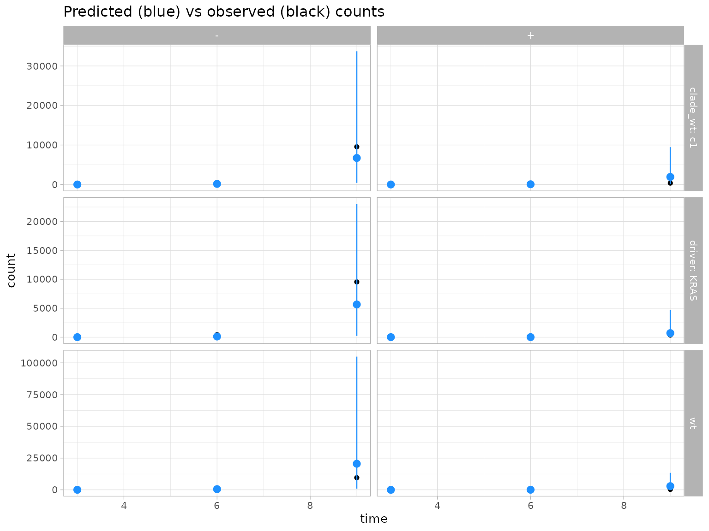
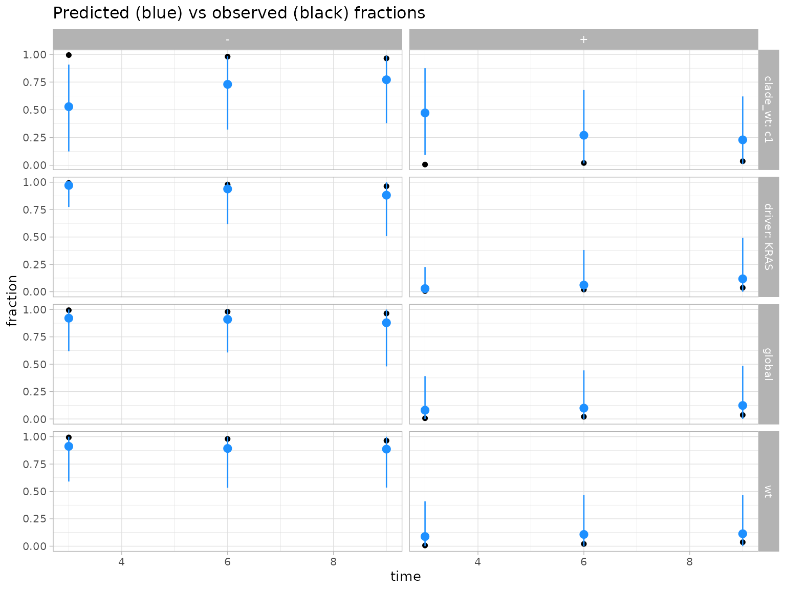
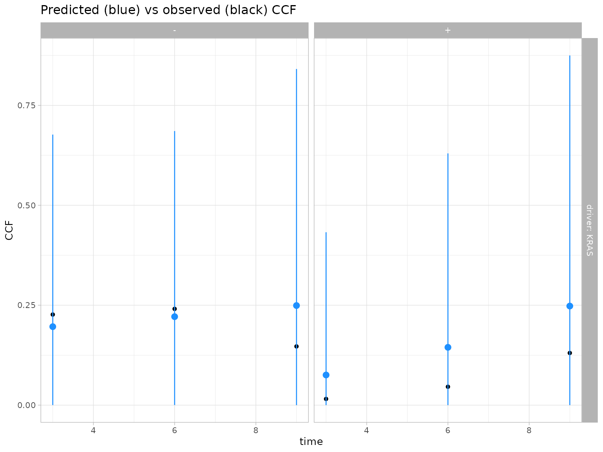
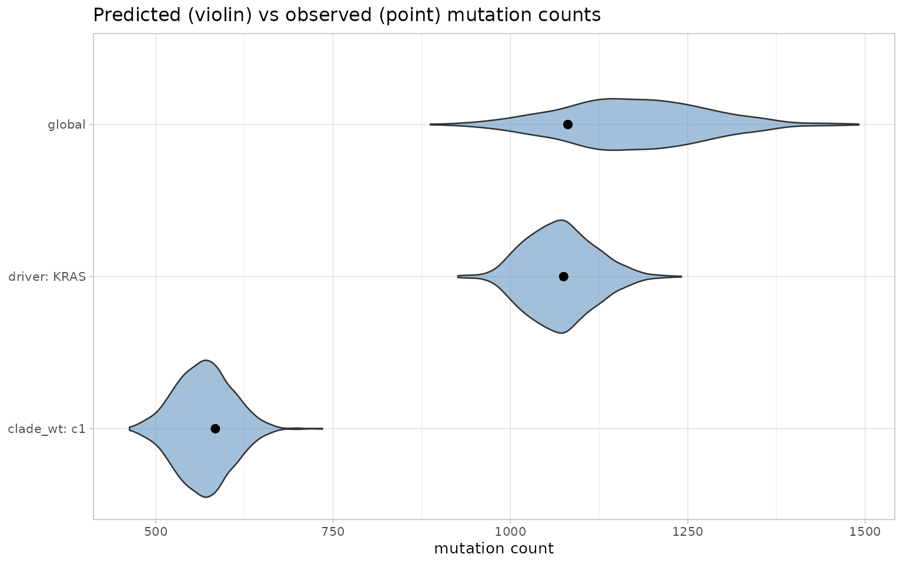
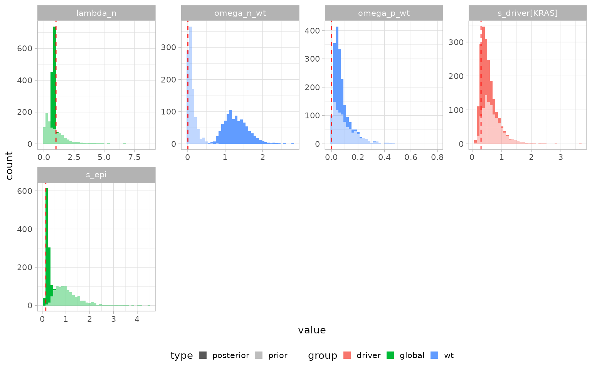

# Multirates inference

``` r

library(PEPI)
library(cmdstanr)
#> This is cmdstanr version 0.8.0
#> - CmdStanR documentation and vignettes: mc-stan.org/cmdstanr
#> - CmdStan path: /home/runner/.cmdstan/cmdstan-2.39.0
#> - CmdStan version: 2.39.0
library(dplyr)
#> 
#> Attaching package: 'dplyr'
#> The following objects are masked from 'package:stats':
#> 
#>     filter, lag
#> The following objects are masked from 'package:base':
#> 
#>     intersect, setdiff, setequal, union
library(ggplot2)
```

PEPI’s unified model (`inst/multirates_positive_s.stan`) jointly infers,
from multi-sample VAF-derived CCF data collected at several sampling
times:

- the base growth rate `lambda_n` and epigenetic fitness `s_epi` of a
  wild-type (“wt”) background population switching between “-” and “+”
  epistates at rates `omega_n_wt`/`omega_p_wt`;
- any number of **driver** clades (their own fitness `s_driver` and
  switch rates), **driver-only** clades confined to a single epistate
  (`driver_n`/`driver_p`), and **driver+clade** combos (`dc`, a driver
  acquisition followed by a further epimutation-switch event); and
- **wt-background clades** (`clades_wt`), sub-lineages of the wt
  population tracked for their own epistate composition.

## Simulate a synthetic dataset

We simulate one driver clade and one wt-background clade, both acquired
before the first sampling time, and observed at three time points. Data
are generated with the same deterministic growth/switch ODE the Stan
model itself assumes as its likelihood mean; `kappa` is kept modest here
so the simulated CCF/fraction noise is not razor-sharp, which keeps the
model’s default initialization well-behaved for this small illustrative
dataset.

``` r


set.seed(1908)

sim = simulate_multirates_tree(
  sampling_times = c(3, 6, 9),
  tmrca = 1, t_min = 0,
  lambda_n = 1, s_epi = 0.15,
  omega_n_wt = 5e-3, omega_p_wt = 2e-3,
  drivers = list(
    list(id = "KRAS", t_driver = 2, s_driver = 0.3,
        omega_n_driver = 5e-3, omega_p_driver = 2e-3,
        ms_driver = -0.5, sigma_driver = 0.5,
        alpha_n_driver = 1, beta_n_driver = 10,
        alpha_p_driver = 1, beta_p_driver = 10)
  ),
  clades_wt = list(
    list(id = "c1", t_clade_wt = 1.5)
  ),
  mu = 1e-7, l = 2.7e9, kappa = 20, sigma_count = 0.1,
  seed = 42
)

sim$tables$population_sizes
#> # A tibble: 3 × 4
#>    time type     zminus   zplus
#>   <dbl> <chr>     <dbl>   <dbl>
#> 1     3 sampling   26.2   0.169
#> 2     6 sampling  433.    9.06 
#> 3     9 sampling 9546.  357.
sim$tables$driver_muts
#> # A tibble: 1 × 8
#>   driver_id m_driver ms_driver sigma_driver alpha_n_driver beta_n_driver
#>   <chr>        <int>     <dbl>        <dbl>          <dbl>         <dbl>
#> 1 KRAS          1075      -0.5          0.5              1            10
#> # ℹ 2 more variables: alpha_p_driver <dbl>, beta_p_driver <dbl>
sim$tables$driver_ccf
#> # A tibble: 6 × 4
#>   driver_id  time epistate    ccf
#>   <chr>     <dbl> <chr>     <dbl>
#> 1 KRAS          3 -        0.227 
#> 2 KRAS          3 +        0.0155
#> 3 KRAS          6 -        0.241 
#> 4 KRAS          6 +        0.0460
#> 5 KRAS          9 -        0.147 
#> 6 KRAS          9 +        0.130
sim$truth
#> $lambda_n
#> [1] 1
#> 
#> $s_epi
#> [1] 0.15
#> 
#> $omega_n_wt
#> [1] 0.005
#> 
#> $omega_p_wt
#> [1] 0.002
#> 
#> $tmrca
#> [1] 1
#> 
#> $t_min
#> [1] 0
#> 
#> $m_trunk
#> [1] 1081
#> 
#> $s_driver
#> KRAS 
#>  0.3 
#> 
#> $s_driver_n
#> named list()
#> 
#> $s_driver_p
#> named list()
#> 
#> $s_dc
#> named list()
```

## Fit the model

``` r


x = init_multirates(sim$tables, m_trunk = sim$truth$m_trunk)

x = fit_multirates(x, cmdstan_path = cmdstanr::cmdstan_path(),
                   method = "variational", ndraws = 1000, seed = 45,
                   mu = 1e-7, l = 2.7e9, t_min = 0,
                   ms_epi = 0, sigma_epi = 0.5,
                   alpha_lambda = 1, beta_lambda = 1,
                   alpha_n_wt = 1, beta_n_wt = 10, alpha_p_wt = 1, beta_p_wt = 10,
                   min_kappa = 5, max_kappa = 200,
                   min_sigma_count = 0.01, max_sigma_count = 1)
#> CmdStan path set to: /home/runner/.cmdstan/cmdstan-2.39.0
#> Init values were only set for a subset of parameters. 
#> Missing init values for the following parameters:
#> lambda_n, s_epi, omega_p_wt, omega_n_wt, bc_wt, U_wt, W_wt, bc_clade_wt, s_driver, bc_driver, U_driver, W_driver, s_driver_n, t_driver_n, bc_driver_n, s_driver_p, t_driver_p, bc_driver_p, s_dc, delta_t_dc, bc_driver_dc, bc_clade_dc, U_dc, W_dc, omega_p_dc, omega_n_dc, omega_p_driver, omega_n_driver, kappa, sigma_count
#> 
#> To disable this message use options(cmdstanr_warn_inits = FALSE).
#> ------------------------------------------------------------ 
#> EXPERIMENTAL ALGORITHM: 
#>   This procedure has not been thoroughly tested and may be unstable 
#>   or buggy. The interface is subject to change. 
#> ------------------------------------------------------------ 
#> Rejecting initial value: 
#>   Error evaluating the log probability at the initial value. 
#> Exception: lub_constrain: lb is 4.87392, but must be less than 3.000000 (in '/tmp/Rtmp7NgXp0/model-1f8e4770cd31.stan', line 353, column 2 to column 81) 
#> Rejecting initial value: 
#>   Error evaluating the log probability at the initial value. 
#> Exception: lub_constrain: lb is 5.59741, but must be less than 3.000000 (in '/tmp/Rtmp7NgXp0/model-1f8e4770cd31.stan', line 353, column 2 to column 81) 
#> Rejecting initial value: 
#>   Error evaluating the log probability at the initial value. 
#> Exception: lub_constrain: lb is 6.88754, but must be less than 3.000000 (in '/tmp/Rtmp7NgXp0/model-1f8e4770cd31.stan', line 353, column 2 to column 81) 
#> Gradient evaluation took 7.7e-05 seconds 
#> 1000 transitions using 10 leapfrog steps per transition would take 0.77 seconds. 
#> Adjust your expectations accordingly! 
#> Begin eta adaptation. 
#> Iteration:   1 / 250 [  0%]  (Adaptation) 
#> Iteration:  50 / 250 [ 20%]  (Adaptation) 
#> Iteration: 100 / 250 [ 40%]  (Adaptation) 
#> Iteration: 150 / 250 [ 60%]  (Adaptation) 
#> Iteration: 200 / 250 [ 80%]  (Adaptation) 
#> Iteration: 250 / 250 [100%]  (Adaptation) 
#> Success! Found best value [eta = 0.1]. 
#> Begin stochastic gradient ascent. 
#>   iter             ELBO   delta_ELBO_mean   delta_ELBO_med   notes  
#>    100        -4217.949             1.000            1.000 
#>    200         -806.620             2.615            4.229 
#>    300         -315.630             2.262            1.556 
#>    400         -212.549             1.817            1.556 
#>    500         -161.714             1.517            1.000 
#>    600         -126.474             1.310            1.000 
#>    700          -90.461             1.180            0.485 
#>    800          -78.260             1.052            0.485 
#>    900          -74.109             0.941            0.398 
#>   1000          -67.179             0.858            0.398 
#>   1100          -62.939             0.764            0.314   MAY BE DIVERGING... INSPECT ELBO 
#>   1200          -58.695             0.349            0.279 
#>   1300          -57.094             0.196            0.156 
#>   1400          -55.924             0.149            0.103 
#>   1500          -54.715             0.120            0.072 
#>   1600          -53.765             0.094            0.067 
#>   1700          -53.733             0.054            0.056 
#>   1800          -52.085             0.042            0.032 
#>   1900          -51.622             0.037            0.028 
#>   2000          -50.928             0.028            0.022 
#>   2100          -51.332             0.022            0.021 
#>   2200          -51.179             0.015            0.018 
#>   2300          -51.188             0.013            0.014 
#>   2400          -50.887             0.011            0.009   MEDIAN ELBO CONVERGED 
#> Drawing a sample of size 1000 from the approximate posterior...  
#> COMPLETED. 
#> Finished in  0.3 seconds.
```

## Extract the posterior

``` r


x = get_posterior_multirates(x)
x$posterior$multirates
#> # A tibble: 80,000 × 14
#>    type  family group id    sampling_time epistate event quantity base  variable
#>    <chr> <chr>  <chr> <chr>         <dbl> <chr>    <int> <chr>    <chr> <chr>   
#>  1 post… param  clad… c1               NA NA          NA NA       bc_c… bc_clad…
#>  2 post… param  clad… c1               NA NA          NA NA       bc_c… bc_clad…
#>  3 post… param  clad… c1               NA NA          NA NA       bc_c… bc_clad…
#>  4 post… param  clad… c1               NA NA          NA NA       bc_c… bc_clad…
#>  5 post… param  clad… c1               NA NA          NA NA       bc_c… bc_clad…
#>  6 post… param  clad… c1               NA NA          NA NA       bc_c… bc_clad…
#>  7 post… param  clad… c1               NA NA          NA NA       bc_c… bc_clad…
#>  8 post… param  clad… c1               NA NA          NA NA       bc_c… bc_clad…
#>  9 post… param  clad… c1               NA NA          NA NA       bc_c… bc_clad…
#> 10 post… param  clad… c1               NA NA          NA NA       bc_c… bc_clad…
#> # ℹ 79,990 more rows
#> # ℹ 4 more variables: .chain <int>, .iteration <int>, .draw <int>, value <dbl>
```

## Predicted vs observed

``` r

plot_counts_multirates(x)
```



``` r

plot_fractions(x)
```



``` r

plot_ccf(x)
```



``` r

plot_mutations(x)
```



## Posterior vs prior, and ground-truth recovery

``` r


plot_inference(x, params = c("lambda_n","s_epi","s_driver","omega_n_wt","omega_p_wt")) +
  geom_vline(
    data = data.frame(
      facet = c("lambda_n","s_epi","omega_n_wt","omega_p_wt","s_driver[KRAS]"),
      truth = c(sim$truth$lambda_n, sim$truth$s_epi, sim$truth$omega_n_wt,
               sim$truth$omega_p_wt, sim$truth$s_driver[["KRAS"]])
    ),
    aes(xintercept = truth), linetype = "dashed", color = "red"
  )
```



The dashed red lines mark the ground-truth values used to simulate the
data; posterior histograms should bracket them.
