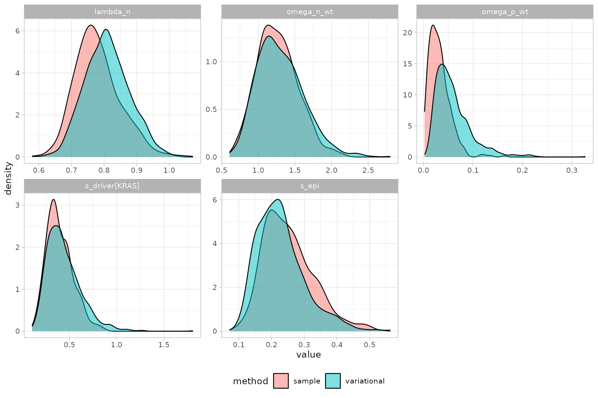

# Variational vs MCMC inference

``` r

library(PEPI)
library(cmdstanr)
#> This is cmdstanr version 0.8.0
#> - CmdStanR documentation and vignettes: mc-stan.org/cmdstanr
#> - CmdStan path: /home/runner/.cmdstan/cmdstan-2.39.0
#> - CmdStan version: 2.39.0
library(dplyr)
#> 
#> Attaching package: 'dplyr'
#> The following objects are masked from 'package:stats':
#> 
#>     filter, lag
#> The following objects are masked from 'package:base':
#> 
#>     intersect, setdiff, setequal, union
library(ggplot2)
```

[`fit_multirates()`](https://caravagnalab.github.io/PEPI/reference/fit_multirates.md)
supports two inference methods:

- `method = "variational"` (the default) runs ADVI, cmdstanr’s automatic
  differentiation variational inference. It is fast and a good choice
  while exploring data or iterating on priors, but it approximates the
  posterior with a (full-rank Gaussian) parametric family, has no
  convergence diagnostics, and can under- or over-estimate uncertainty
  in ways that are hard to detect from the fit alone.
- `method = "sample"` runs full Hamiltonian Monte Carlo (NUTS). It is
  slower but asymptotically exact, and comes with the convergence
  diagnostics covered in `vignette("Convergence_diagnostics")` (R-hat,
  effective sample size, divergences, …).

This vignette fits the same data both ways and compares the two
posteriors directly, to build intuition for when the difference matters.

## Simulate data and fit both ways

``` r


set.seed(42)

sim = simulate_multirates_tree(
  sampling_times = c(3, 6, 9),
  tmrca = 1, t_min = 0,
  lambda_n = 1, s_epi = 0.15,
  omega_n_wt = 5e-3, omega_p_wt = 2e-3,
  drivers = list(
    list(id = "KRAS", t_driver = 2, s_driver = 0.3,
        omega_n_driver = 5e-3, omega_p_driver = 2e-3,
        ms_driver = -0.5, sigma_driver = 0.5,
        alpha_n_driver = 1, beta_n_driver = 10,
        alpha_p_driver = 1, beta_p_driver = 10)
  ),
  clades_wt = list(
    list(id = "c1", t_clade_wt = 1.5)
  ),
  mu = 1e-7, l = 2.7e9, kappa = 20, sigma_count = 0.1,
  seed = 42
)

fit_args = list(
  cmdstan_path = cmdstanr::cmdstan_path(), seed = 45,
  mu = 1e-7, l = 2.7e9, t_min = 0, ms_epi = 0, sigma_epi = 0.5,
  alpha_lambda = 1, beta_lambda = 1, alpha_n_wt = 1, beta_n_wt = 10,
  alpha_p_wt = 1, beta_p_wt = 10, min_kappa = 5, max_kappa = 200,
  min_sigma_count = 0.01, max_sigma_count = 1
)

x_vb = init_multirates(sim$tables, m_trunk = sim$truth$m_trunk)
x_vb = do.call(fit_multirates, c(list(x = x_vb, method = "variational", ndraws = 1000), fit_args))
#> CmdStan path set to: /home/runner/.cmdstan/cmdstan-2.39.0
#> Init values were only set for a subset of parameters. 
#> Missing init values for the following parameters:
#> lambda_n, s_epi, omega_p_wt, omega_n_wt, bc_wt, U_wt, W_wt, bc_clade_wt, s_driver, bc_driver, U_driver, W_driver, s_driver_n, t_driver_n, bc_driver_n, s_driver_p, t_driver_p, bc_driver_p, s_dc, delta_t_dc, bc_driver_dc, bc_clade_dc, U_dc, W_dc, omega_p_dc, omega_n_dc, omega_p_driver, omega_n_driver, kappa, sigma_count
#> 
#> To disable this message use options(cmdstanr_warn_inits = FALSE).
#> ------------------------------------------------------------ 
#> EXPERIMENTAL ALGORITHM: 
#>   This procedure has not been thoroughly tested and may be unstable 
#>   or buggy. The interface is subject to change. 
#> ------------------------------------------------------------ 
#> Rejecting initial value: 
#>   Error evaluating the log probability at the initial value. 
#> Exception: lub_constrain: lb is 4.87392, but must be less than 3.000000 (in '/tmp/RtmpXzPQde/model-1e9d4af68df0.stan', line 353, column 2 to column 81) 
#> Rejecting initial value: 
#>   Error evaluating the log probability at the initial value. 
#> Exception: lub_constrain: lb is 5.59741, but must be less than 3.000000 (in '/tmp/RtmpXzPQde/model-1e9d4af68df0.stan', line 353, column 2 to column 81) 
#> Rejecting initial value: 
#>   Error evaluating the log probability at the initial value. 
#> Exception: lub_constrain: lb is 6.88754, but must be less than 3.000000 (in '/tmp/RtmpXzPQde/model-1e9d4af68df0.stan', line 353, column 2 to column 81) 
#> Gradient evaluation took 7.9e-05 seconds 
#> 1000 transitions using 10 leapfrog steps per transition would take 0.79 seconds. 
#> Adjust your expectations accordingly! 
#> Begin eta adaptation. 
#> Iteration:   1 / 250 [  0%]  (Adaptation) 
#> Iteration:  50 / 250 [ 20%]  (Adaptation) 
#> Iteration: 100 / 250 [ 40%]  (Adaptation) 
#> Iteration: 150 / 250 [ 60%]  (Adaptation) 
#> Iteration: 200 / 250 [ 80%]  (Adaptation) 
#> Iteration: 250 / 250 [100%]  (Adaptation) 
#> Success! Found best value [eta = 0.1]. 
#> Begin stochastic gradient ascent. 
#>   iter             ELBO   delta_ELBO_mean   delta_ELBO_med   notes  
#>    100        -4217.949             1.000            1.000 
#>    200         -806.620             2.615            4.229 
#>    300         -315.630             2.262            1.556 
#>    400         -212.549             1.817            1.556 
#>    500         -161.714             1.517            1.000 
#>    600         -126.474             1.310            1.000 
#>    700          -90.461             1.180            0.485 
#>    800          -78.260             1.052            0.485 
#>    900          -74.109             0.941            0.398 
#>   1000          -67.179             0.858            0.398 
#>   1100          -62.939             0.764            0.314   MAY BE DIVERGING... INSPECT ELBO 
#>   1200          -58.695             0.349            0.279 
#>   1300          -57.094             0.196            0.156 
#>   1400          -55.924             0.149            0.103 
#>   1500          -54.715             0.120            0.072 
#>   1600          -53.765             0.094            0.067 
#>   1700          -53.733             0.054            0.056 
#>   1800          -52.085             0.042            0.032 
#>   1900          -51.622             0.037            0.028 
#>   2000          -50.928             0.028            0.022 
#>   2100          -51.332             0.022            0.021 
#>   2200          -51.179             0.015            0.018 
#>   2300          -51.188             0.013            0.014 
#>   2400          -50.887             0.011            0.009   MEDIAN ELBO CONVERGED 
#> Drawing a sample of size 1000 from the approximate posterior...  
#> COMPLETED. 
#> Finished in  0.3 seconds.
x_vb = get_posterior_multirates(x_vb)

x_mc = init_multirates(sim$tables, m_trunk = sim$truth$m_trunk)
x_mc = do.call(fit_multirates, c(list(x = x_mc, method = "sample", chains = 2, ndraws = 200), fit_args))
#> CmdStan path set to: /home/runner/.cmdstan/cmdstan-2.39.0
#> Init values were only set for a subset of parameters. 
#> Missing init values for the following parameters:
#>  - chain 1: lambda_n, s_epi, omega_p_wt, omega_n_wt, bc_wt, U_wt, W_wt, bc_clade_wt, s_driver, bc_driver, U_driver, W_driver, s_driver_n, t_driver_n, bc_driver_n, s_driver_p, t_driver_p, bc_driver_p, s_dc, delta_t_dc, bc_driver_dc, bc_clade_dc, U_dc, W_dc, omega_p_dc, omega_n_dc, omega_p_driver, omega_n_driver, kappa, sigma_count
#>  - chain 2: lambda_n, s_epi, omega_p_wt, omega_n_wt, bc_wt, U_wt, W_wt, bc_clade_wt, s_driver, bc_driver, U_driver, W_driver, s_driver_n, t_driver_n, bc_driver_n, s_driver_p, t_driver_p, bc_driver_p, s_dc, delta_t_dc, bc_driver_dc, bc_clade_dc, U_dc, W_dc, omega_p_dc, omega_n_dc, omega_p_driver, omega_n_driver, kappa, sigma_count
#> 
#> To disable this message use options(cmdstanr_warn_inits = FALSE).
#> Running MCMC with 2 sequential chains...
#> Chain 1 Rejecting initial value:
#> Chain 1   Error evaluating the log probability at the initial value.
#> Chain 1 Exception: lub_constrain: lb is 4.87392, but must be less than 3.000000 (in '/tmp/RtmpXzPQde/model-1e9d4af68df0.stan', line 353, column 2 to column 81)
#> Chain 1 Exception: lub_constrain: lb is 4.87392, but must be less than 3.000000 (in '/tmp/RtmpXzPQde/model-1e9d4af68df0.stan', line 353, column 2 to column 81)
#> Chain 1 Rejecting initial value:
#> Chain 1   Error evaluating the log probability at the initial value.
#> Chain 1 Exception: lub_constrain: lb is 5.59741, but must be less than 3.000000 (in '/tmp/RtmpXzPQde/model-1e9d4af68df0.stan', line 353, column 2 to column 81)
#> Chain 1 Exception: lub_constrain: lb is 5.59741, but must be less than 3.000000 (in '/tmp/RtmpXzPQde/model-1e9d4af68df0.stan', line 353, column 2 to column 81)
#> Chain 1 Rejecting initial value:
#> Chain 1   Error evaluating the log probability at the initial value.
#> Chain 1 Exception: lub_constrain: lb is 6.88754, but must be less than 3.000000 (in '/tmp/RtmpXzPQde/model-1e9d4af68df0.stan', line 353, column 2 to column 81)
#> Chain 1 Exception: lub_constrain: lb is 6.88754, but must be less than 3.000000 (in '/tmp/RtmpXzPQde/model-1e9d4af68df0.stan', line 353, column 2 to column 81)
#> Chain 1 Iteration:    1 / 1200 [  0%]  (Warmup)
#> Chain 1 Informational Message: The current Metropolis proposal is about to be rejected because of the following issue:
#> Chain 1 Exception: lub_constrain: lb is 9, but must be less than 3.000000 (in '/tmp/RtmpXzPQde/model-1e9d4af68df0.stan', line 353, column 2 to column 81)
#> Chain 1 If this warning occurs sporadically, such as for highly constrained variable types like covariance matrices, then the sampler is fine,
#> Chain 1 but if this warning occurs often then your model may be either severely ill-conditioned or misspecified.
#> Chain 1
#> Chain 1 Informational Message: The current Metropolis proposal is about to be rejected because of the following issue:
#> Chain 1 Exception: lub_constrain: lb is 9, but must be less than 3.000000 (in '/tmp/RtmpXzPQde/model-1e9d4af68df0.stan', line 353, column 2 to column 81)
#> Chain 1 If this warning occurs sporadically, such as for highly constrained variable types like covariance matrices, then the sampler is fine,
#> Chain 1 but if this warning occurs often then your model may be either severely ill-conditioned or misspecified.
#> Chain 1
#> Chain 1 Informational Message: The current Metropolis proposal is about to be rejected because of the following issue:
#> Chain 1 Exception: lub_constrain: lb is 9, but must be less than 3.000000 (in '/tmp/RtmpXzPQde/model-1e9d4af68df0.stan', line 353, column 2 to column 81)
#> Chain 1 If this warning occurs sporadically, such as for highly constrained variable types like covariance matrices, then the sampler is fine,
#> Chain 1 but if this warning occurs often then your model may be either severely ill-conditioned or misspecified.
#> Chain 1
#> Chain 1 Informational Message: The current Metropolis proposal is about to be rejected because of the following issue:
#> Chain 1 Exception: lub_constrain: lb is 9, but must be less than 3.000000 (in '/tmp/RtmpXzPQde/model-1e9d4af68df0.stan', line 353, column 2 to column 81)
#> Chain 1 If this warning occurs sporadically, such as for highly constrained variable types like covariance matrices, then the sampler is fine,
#> Chain 1 but if this warning occurs often then your model may be either severely ill-conditioned or misspecified.
#> Chain 1
#> Chain 1 Informational Message: The current Metropolis proposal is about to be rejected because of the following issue:
#> Chain 1 Exception: lub_constrain: lb is 9, but must be less than 3.000000 (in '/tmp/RtmpXzPQde/model-1e9d4af68df0.stan', line 353, column 2 to column 81)
#> Chain 1 If this warning occurs sporadically, such as for highly constrained variable types like covariance matrices, then the sampler is fine,
#> Chain 1 but if this warning occurs often then your model may be either severely ill-conditioned or misspecified.
#> Chain 1
#> Chain 1 Informational Message: The current Metropolis proposal is about to be rejected because of the following issue:
#> Chain 1 Exception: lub_constrain: lb is 8.99695, but must be less than 3.000000 (in '/tmp/RtmpXzPQde/model-1e9d4af68df0.stan', line 353, column 2 to column 81)
#> Chain 1 If this warning occurs sporadically, such as for highly constrained variable types like covariance matrices, then the sampler is fine,
#> Chain 1 but if this warning occurs often then your model may be either severely ill-conditioned or misspecified.
#> Chain 1
#> Chain 1 Informational Message: The current Metropolis proposal is about to be rejected because of the following issue:
#> Chain 1 Exception: lub_constrain: lb is 5.17598, but must be less than 3.000000 (in '/tmp/RtmpXzPQde/model-1e9d4af68df0.stan', line 353, column 2 to column 81)
#> Chain 1 If this warning occurs sporadically, such as for highly constrained variable types like covariance matrices, then the sampler is fine,
#> Chain 1 but if this warning occurs often then your model may be either severely ill-conditioned or misspecified.
#> Chain 1
#> Chain 1 Informational Message: The current Metropolis proposal is about to be rejected because of the following issue:
#> Chain 1 Exception: lub_constrain: lb is 9, but must be less than 3.000000 (in '/tmp/RtmpXzPQde/model-1e9d4af68df0.stan', line 353, column 2 to column 81)
#> Chain 1 If this warning occurs sporadically, such as for highly constrained variable types like covariance matrices, then the sampler is fine,
#> Chain 1 but if this warning occurs often then your model may be either severely ill-conditioned or misspecified.
#> Chain 1
#> Chain 1 Informational Message: The current Metropolis proposal is about to be rejected because of the following issue:
#> Chain 1 Exception: lub_constrain: lb is 9, but must be less than 3.000000 (in '/tmp/RtmpXzPQde/model-1e9d4af68df0.stan', line 353, column 2 to column 81)
#> Chain 1 If this warning occurs sporadically, such as for highly constrained variable types like covariance matrices, then the sampler is fine,
#> Chain 1 but if this warning occurs often then your model may be either severely ill-conditioned or misspecified.
#> Chain 1
#> Chain 1 Informational Message: The current Metropolis proposal is about to be rejected because of the following issue:
#> Chain 1 Exception: lub_constrain: lb is 9, but must be less than 3.000000 (in '/tmp/RtmpXzPQde/model-1e9d4af68df0.stan', line 353, column 2 to column 81)
#> Chain 1 If this warning occurs sporadically, such as for highly constrained variable types like covariance matrices, then the sampler is fine,
#> Chain 1 but if this warning occurs often then your model may be either severely ill-conditioned or misspecified.
#> Chain 1
#> Chain 1 Informational Message: The current Metropolis proposal is about to be rejected because of the following issue:
#> Chain 1 Exception: lub_constrain: lb is 3.00815, but must be less than 3.000000 (in '/tmp/RtmpXzPQde/model-1e9d4af68df0.stan', line 353, column 2 to column 81)
#> Chain 1 If this warning occurs sporadically, such as for highly constrained variable types like covariance matrices, then the sampler is fine,
#> Chain 1 but if this warning occurs often then your model may be either severely ill-conditioned or misspecified.
#> Chain 1
#> Chain 1 Iteration:  100 / 1200 [  8%]  (Warmup)
#> Chain 1 Informational Message: The current Metropolis proposal is about to be rejected because of the following issue:
#> Chain 1 Exception: lub_constrain: lb is 3.29367, but must be less than 3.000000 (in '/tmp/RtmpXzPQde/model-1e9d4af68df0.stan', line 353, column 2 to column 81)
#> Chain 1 If this warning occurs sporadically, such as for highly constrained variable types like covariance matrices, then the sampler is fine,
#> Chain 1 but if this warning occurs often then your model may be either severely ill-conditioned or misspecified.
#> Chain 1
#> Chain 1 Iteration:  200 / 1200 [ 16%]  (Warmup) 
#> Chain 1 Iteration:  300 / 1200 [ 25%]  (Warmup) 
#> Chain 1 Iteration:  400 / 1200 [ 33%]  (Warmup) 
#> Chain 1 Iteration:  500 / 1200 [ 41%]  (Warmup) 
#> Chain 1 Iteration:  600 / 1200 [ 50%]  (Warmup) 
#> Chain 1 Iteration:  700 / 1200 [ 58%]  (Warmup) 
#> Chain 1 Iteration:  800 / 1200 [ 66%]  (Warmup) 
#> Chain 1 Iteration:  900 / 1200 [ 75%]  (Warmup) 
#> Chain 1 Iteration: 1000 / 1200 [ 83%]  (Warmup) 
#> Chain 1 Iteration: 1001 / 1200 [ 83%]  (Sampling) 
#> Chain 1 Iteration: 1100 / 1200 [ 91%]  (Sampling) 
#> Chain 1 Iteration: 1200 / 1200 [100%]  (Sampling) 
#> Chain 1 finished in 1.2 seconds.
#> Chain 2 Iteration:    1 / 1200 [  0%]  (Warmup)
#> Chain 2 Informational Message: The current Metropolis proposal is about to be rejected because of the following issue:
#> Chain 2 Exception: lub_constrain: lb is 9, but must be less than 3.000000 (in '/tmp/RtmpXzPQde/model-1e9d4af68df0.stan', line 353, column 2 to column 81)
#> Chain 2 If this warning occurs sporadically, such as for highly constrained variable types like covariance matrices, then the sampler is fine,
#> Chain 2 but if this warning occurs often then your model may be either severely ill-conditioned or misspecified.
#> Chain 2
#> Chain 2 Informational Message: The current Metropolis proposal is about to be rejected because of the following issue:
#> Chain 2 Exception: lub_constrain: lb is 9, but must be less than 3.000000 (in '/tmp/RtmpXzPQde/model-1e9d4af68df0.stan', line 353, column 2 to column 81)
#> Chain 2 If this warning occurs sporadically, such as for highly constrained variable types like covariance matrices, then the sampler is fine,
#> Chain 2 but if this warning occurs often then your model may be either severely ill-conditioned or misspecified.
#> Chain 2
#> Chain 2 Informational Message: The current Metropolis proposal is about to be rejected because of the following issue:
#> Chain 2 Exception: lub_constrain: lb is 9, but must be less than 3.000000 (in '/tmp/RtmpXzPQde/model-1e9d4af68df0.stan', line 353, column 2 to column 81)
#> Chain 2 If this warning occurs sporadically, such as for highly constrained variable types like covariance matrices, then the sampler is fine,
#> Chain 2 but if this warning occurs often then your model may be either severely ill-conditioned or misspecified.
#> Chain 2
#> Chain 2 Informational Message: The current Metropolis proposal is about to be rejected because of the following issue:
#> Chain 2 Exception: lub_constrain: lb is 9, but must be less than 3.000000 (in '/tmp/RtmpXzPQde/model-1e9d4af68df0.stan', line 353, column 2 to column 81)
#> Chain 2 If this warning occurs sporadically, such as for highly constrained variable types like covariance matrices, then the sampler is fine,
#> Chain 2 but if this warning occurs often then your model may be either severely ill-conditioned or misspecified.
#> Chain 2
#> Chain 2 Informational Message: The current Metropolis proposal is about to be rejected because of the following issue:
#> Chain 2 Exception: lub_constrain: lb is 8.99953, but must be less than 3.000000 (in '/tmp/RtmpXzPQde/model-1e9d4af68df0.stan', line 353, column 2 to column 81)
#> Chain 2 If this warning occurs sporadically, such as for highly constrained variable types like covariance matrices, then the sampler is fine,
#> Chain 2 but if this warning occurs often then your model may be either severely ill-conditioned or misspecified.
#> Chain 2
#> Chain 2 Informational Message: The current Metropolis proposal is about to be rejected because of the following issue:
#> Chain 2 Exception: lub_constrain: lb is 6.51592, but must be less than 3.000000 (in '/tmp/RtmpXzPQde/model-1e9d4af68df0.stan', line 353, column 2 to column 81)
#> Chain 2 If this warning occurs sporadically, such as for highly constrained variable types like covariance matrices, then the sampler is fine,
#> Chain 2 but if this warning occurs often then your model may be either severely ill-conditioned or misspecified.
#> Chain 2
#> Chain 2 Informational Message: The current Metropolis proposal is about to be rejected because of the following issue:
#> Chain 2 Exception: lub_constrain: lb is 9, but must be less than 3.000000 (in '/tmp/RtmpXzPQde/model-1e9d4af68df0.stan', line 353, column 2 to column 81)
#> Chain 2 If this warning occurs sporadically, such as for highly constrained variable types like covariance matrices, then the sampler is fine,
#> Chain 2 but if this warning occurs often then your model may be either severely ill-conditioned or misspecified.
#> Chain 2
#> Chain 2 Informational Message: The current Metropolis proposal is about to be rejected because of the following issue:
#> Chain 2 Exception: lub_constrain: lb is 9, but must be less than 3.000000 (in '/tmp/RtmpXzPQde/model-1e9d4af68df0.stan', line 353, column 2 to column 81)
#> Chain 2 If this warning occurs sporadically, such as for highly constrained variable types like covariance matrices, then the sampler is fine,
#> Chain 2 but if this warning occurs often then your model may be either severely ill-conditioned or misspecified.
#> Chain 2
#> Chain 2 Informational Message: The current Metropolis proposal is about to be rejected because of the following issue:
#> Chain 2 Exception: lub_constrain: lb is 5.75093, but must be less than 3.000000 (in '/tmp/RtmpXzPQde/model-1e9d4af68df0.stan', line 353, column 2 to column 81)
#> Chain 2 If this warning occurs sporadically, such as for highly constrained variable types like covariance matrices, then the sampler is fine,
#> Chain 2 but if this warning occurs often then your model may be either severely ill-conditioned or misspecified.
#> Chain 2
#> Chain 2 Iteration:  100 / 1200 [  8%]  (Warmup) 
#> Chain 2 Iteration:  200 / 1200 [ 16%]  (Warmup)
#> Chain 2 Informational Message: The current Metropolis proposal is about to be rejected because of the following issue:
#> Chain 2 Exception: lub_constrain: lb is 3.23029, but must be less than 3.000000 (in '/tmp/RtmpXzPQde/model-1e9d4af68df0.stan', line 353, column 2 to column 81)
#> Chain 2 If this warning occurs sporadically, such as for highly constrained variable types like covariance matrices, then the sampler is fine,
#> Chain 2 but if this warning occurs often then your model may be either severely ill-conditioned or misspecified.
#> Chain 2
#> Chain 2 Iteration:  300 / 1200 [ 25%]  (Warmup) 
#> Chain 2 Iteration:  400 / 1200 [ 33%]  (Warmup) 
#> Chain 2 Iteration:  500 / 1200 [ 41%]  (Warmup) 
#> Chain 2 Iteration:  600 / 1200 [ 50%]  (Warmup) 
#> Chain 2 Iteration:  700 / 1200 [ 58%]  (Warmup) 
#> Chain 2 Iteration:  800 / 1200 [ 66%]  (Warmup) 
#> Chain 2 Iteration:  900 / 1200 [ 75%]  (Warmup) 
#> Chain 2 Iteration: 1000 / 1200 [ 83%]  (Warmup) 
#> Chain 2 Iteration: 1001 / 1200 [ 83%]  (Sampling) 
#> Chain 2 Iteration: 1100 / 1200 [ 91%]  (Sampling) 
#> Chain 2 Iteration: 1200 / 1200 [100%]  (Sampling) 
#> Chain 2 finished in 1.3 seconds.
#> 
#> Both chains finished successfully.
#> Mean chain execution time: 1.2 seconds.
#> Total execution time: 2.6 seconds.
#> Warning: 1 of 400 (0.0%) transitions ended with a divergence.
#> See https://mc-stan.org/misc/warnings for details.
x_mc = get_posterior_multirates(x_mc)
```

## Compare the two posteriors

``` r


params = c("lambda_n", "s_epi", "s_driver", "omega_n_wt", "omega_p_wt")

comparison = bind_rows(
  x_vb$posterior$multirates %>% filter(family == "param", type == "posterior") %>% mutate(method = "variational"),
  x_mc$posterior$multirates %>% filter(family == "param", type == "posterior") %>% mutate(method = "sample")
) %>%
  filter(base %in% params) %>%
  mutate(facet = ifelse(is.na(id), base, paste0(base, "[", id, "]")))

ggplot(comparison) +
  geom_density(aes(x = value, fill = method), alpha = 0.5) +
  facet_wrap(~facet, scales = "free") +
  theme_light(base_size = 10) +
  theme(legend.position = "bottom")
```



For `lambda_n`, `omega_n_wt`, `s_driver` and `s_epi` the two methods
agree closely. `omega_p_wt` is a different story: ADVI’s Gaussian
approximation gives it a longer right tail than MCMC does, because this
switch rate’s posterior is concentrated near a boundary of its support -
exactly the kind of skewed, non-Gaussian shape ADVI struggles to
approximate well. Had we only fit with `method = "variational"`, we
would have overstated the uncertainty on `omega_p_wt` without any way to
notice from the ADVI fit alone.

## Confirm the MCMC fit is trustworthy before trusting the comparison

The comparison above is only informative if the MCMC fit itself has
converged - otherwise “MCMC disagrees with ADVI” could just as easily
mean “the sampler hasn’t mixed yet”. Always check:

``` r

plot_diagnostics(x_mc)
#> Warning: Groups with fewer than two datapoints have been dropped.
#> ℹ Set `drop = FALSE` to consider such groups for position adjustment purposes.
#> Groups with fewer than two datapoints have been dropped.
#> ℹ Set `drop = FALSE` to consider such groups for position adjustment purposes.
#> `stat_bin()` using `bins = 30`. Pick better value `binwidth`.
#> `stat_bin()` using `bins = 30`. Pick better value `binwidth`.
```


## Practical guidance

- Use `method = "variational"` while exploring data, iterating on
  priors, or checking that the model runs at all - it is typically an
  order of magnitude faster.
- Before reporting final results, refit the same data with
  `method = "sample"` and inspect
  [`plot_diagnostics()`](https://caravagnalab.github.io/PEPI/reference/plot_diagnostics.md).
- If the two posteriors disagree noticeably for a parameter, trust the
  MCMC fit (once it has converged) - ADVI’s approximation error is
  exactly what full sampling is designed to avoid.
